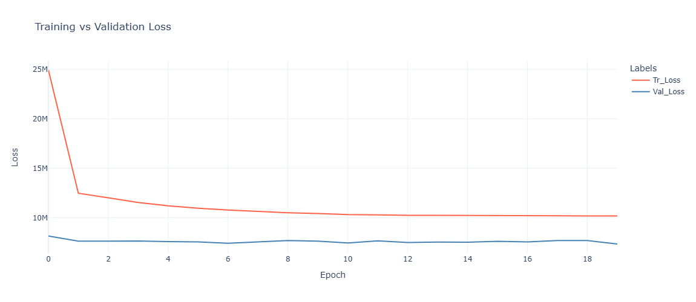

## AI-ANN Regression - Black Friday Sales Prediction


## A. Data Assessment Process   
### A1. Original Dataset Summary:
- Total number of records: 5,50,068
- Total number of features: 12
- Numeric type features: 7 **['User_ID', 'Occupation', 'Marital_Status', 'Product_Category_1', 'Purchase', 'Product_Category_2', 'Product_Category_3']**
- Categorical type features: 5 **['Product_ID', 'Gender', 'Age', 'City_Category', 'Stay_In_Current_City_Years']**
- For ML and AI applications **'Purchase'** feature is the target variable (dependent) and the other 19 features are input (independent).

### A2. Features Description:
| S.NO | Feature                      | Description                                                                         |
|:----:| :---                         | :---                                                                                |
| 1.   | User_ID                      | Unique ID of the customer                                                           |
| 2.   | Product_ID                   | Unique ID of the product purchased                                                  |
| 3.   | Gender                       | Gender of the customer                                                              |
| 4.   | Age                          | Age of the customer in the specified ranges or bins                                 |
| 5.   | Occupation                   | Work profile of the customer. (masked)                                              |
| 6.   | City_Category                | Category of the city where purchase is made                                         |
| 7.   | Stay_In_Current_City_Years   | Number of years customer staying in the city                                        |
| 8.   | Marital_Status               | Married (1) or not (0)                                                              |
| 9.   | Product_Category_1           | Main category of the product. (masked)                                              |
| 10.  | Product_Category_2           | First sub-category of the product. Product may belong to other category. (masked)   |
| 11.  | Product_Category_3           | Second sub-category of the product. Product may belong to other category .(masked)  |
| 12.  | Purchase                     | Purchase amount in dollars.                                                         |
|      |                              |                                                                                     |

### A3. Data Issues:
#### a. Dirty Data (Low quality):
- Completeness: Missing values in 
  - 'Product_Category_2' are 173638 {31.56 %}
  - 'Product_Category_3' are 383247 {69.67 %}.
  
- Validity: 
  - No duplicate observations.
  - Data type of certain features can be fixed or changed.

- Accuracy: No inaccuracy issues.

- Consistency: No inconsistency issues.

#### b. Messy Data (Untidy / Structural):
- No structure related issues.


## B. Data Pre-Processing Results
- Data splitting in Train, Validation, and Test sets.
- Missing value handling and imputation.
- Changing the datatype of certain features.
- Finally, the data sets are saved in the CSV and PKL files for further analysis and ML modelling.


## C. Conclusions / Insights of Exploratory Data Analysis
- Only numerical feature 'Purchase' with 2674 oultiers (0.4863%), and moderate positive skew.
- 'User_ID' and 'Product_ID' are the features which are identifiers for the users and products. So, will be dropped during model buidling process.
- Features with lot of labels or categories (>=15) are ['Occupation', 'Product_Category_1', 'Product_Category_2', 'Product_Category_3'], other features have 2-6 categories.
- Females are generally making more smaller purchases upto 11k and males beyond 11k.
- Older users above (50 years) are purchasing more than younger users.
- Occupations with higher purchase values are 12,15,17 and lower values are 9,19,20. 
- City category 'C' has higher purchase and 'A' has lower values.
- Average 'Purchase' value is nearly same for all the labels of Stay_In_Current_City_Years.
- Singles and married are nearly same for purchase values.        
- Married users staying in city for longer duration are giving more purchases than singles.       


## D. Feature Engineering
- Target Feature Transformation (Power Transformer).
- Drop non relevant features from the observations ['User_ID','Product_ID'], unique in the dataset (to be applied in the pipeline).
- Categorical features handling using Ordinal encoding techniques (to be applied in the pipeline).
- Categorical features handling using OneHot encoding techniques (to be applied in the pipeline).


## E. Model Building and Hyper Parameter Tuning
- List of models compared: 8 **[M1, M2, M3, M4, M5, M6, M7, M8]**.


## F. Best Model (Production) Results
- Model: M7 with total 7 layers and trained with 20 epochs as given below.
  ```python
    def model_m7():
      model = Sequential()

      model.add(Dense(50, activation='relu', input_dim=74))
      model.add(Dropout(0.4))
      model.add(Dense(50, activation='tanh'))
      model.add(Dropout(0.5))
      model.add(Dense(25, activation='relu'))
      model.add(Dropout(0.2))
      model.add(Dense(1, activation='linear'))

      model.compile(optimizer=tf.keras.optimizers.Adam(learning_rate=0.001), loss='mean_squared_error')

      return model
  ```

- Results: Train Size (549868, 74), Validation Size (100, 74)   
  - R2 Score : Train Dataset: 65.861 %, Validation Dataset: 68.0333 %   
  - RMSE Score : Train Dataset: 2934.8925, Validation Dataset: 2707.6454  

- Charts:
>
*Performance of the production model*    


## G. Gradio App Development  
- Gradio app inside the Jupyter Notebook file 'MDL_BFS_F_GR_APP.ipynb'.
- App accepts the inputs from the user through the UI interface, performs the logic using production model, and displays the prediction as output.
- The user can try out some examples to see the app's working.
